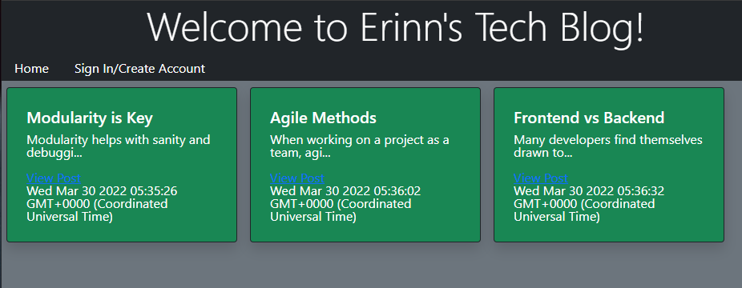

# Tech Blog

## Description
A fullstack blog app that allows user to login and execute CRUD methods on posts and comments.

## Deployed Site
https://erinnstechblog.herokuapp.com/

## Table of Contents
* [Technologies](#technologies)
* [Usage](#usage)
* [Questions](#questions)

## Technologies
* HTML
* CSS
* Bootstrap
* Express
* Node
* MySQL
* Sequelize
* Heroku
* JawsDB

## Usage
Create an account to access your dashboard where you can write new blog posts and comment on others' posts.

---
### Questions
erinnmatesi@gmail.com
[ErinnMatesi](https://github.com/ErinnMatesi)
